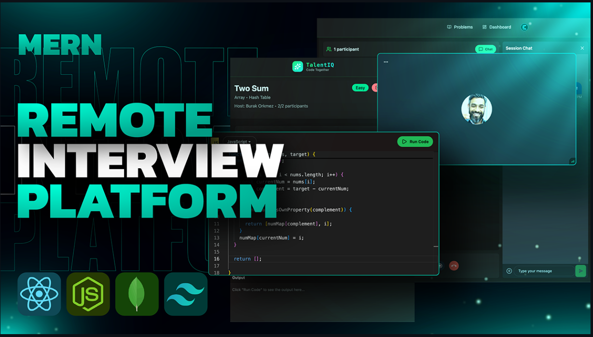

# ✨ Full-Stack Interview Platform ✨ - PrepVerse-IQ

A real-time collaborative coding platform for technical interview preparation. Practice coding problems with peers through live video calls, shared code editors, and instant messaging.



## 🚀 Features

- **Real-Time Video Calls** - HD video/audio powered by Stream SDK
- **Live Code Editor** - Collaborative Monaco editor with syntax highlighting
- **Multi-Language Support** - JavaScript, Python, and Java
- **Code Execution** - Run and test code instantly using Piston API
- **Problem Library** - Curated coding challenges with difficulty levels
- **Session Management** - Create, join, and manage interview sessions
- **Instant Messaging** - Built-in chat for seamless communication

## 🛠️ Tech Stack

**Frontend:**
- React 18 + Vite
- TailwindCSS + DaisyUI
- Stream Video/Chat SDK
- Monaco Editor
- React Query
- Clerk Authentication

**Backend:**
- Node.js + Express
- MongoDB + Mongoose
- Stream API (Video/Chat)
- Inngest (Event handling)
- Clerk (Auth)

## 📦 Installation

1. **Clone the repository**
```bash
git clone https://github.com/tehami326/prepverse-IQ.git
cd prepverse-IQ
```

2. **Install dependencies**
```bash
# Backend
cd backend
npm install

# Frontend
cd ../frontend
npm install
```

3. **Environment Setup**

Create `.env` in backend:
```env
PORT=3000
DB_URL=your_mongodb_url
NODE_ENV=development
CLIENT_URL=http://localhost:5173
STREAM_API_KEY=your_stream_key
STREAM_API_SECRET=your_stream_secret
CLERK_PUBLISHABLE_KEY=your_clerk_key
CLERK_SECRET_KEY=your_clerk_secret
INNGEST_EVENT_KEY=your_inngest_key
INNGEST_SIGNING_KEY=your_inngest_signing_key
```

Create `.env` in frontend:
```env
VITE_CLERK_PUBLISHABLE_KEY=your_clerk_key
VITE_API_URL=http://localhost:3000/api
VITE_STREAM_API_KEY=your_stream_key
```

4. **Run the application**
```bash
# Backend (from backend folder)
npm run dev

# Frontend (from frontend folder)
npm run dev
```

## 🎯 Usage

1. **Sign Up/Login** - Create account via Clerk authentication
2. **Dashboard** - View active sessions and your history
3. **Create Session** - Select a problem and start a new session
4. **Join Session** - Join available sessions from the dashboard
5. **Code Together** - Collaborate in real-time with video, code, and chat
6. **Run & Test** - Execute code and verify solutions

## 📁 Project Structure

```
prepverse-IQ/
├── backend/
│   ├── controllers/     # API controllers
│   ├── models/          # MongoDB schemas
│   ├── routes/          # Express routes
│   ├── lib/             # Stream, DB, Inngest config
│   └── middleware/      # Auth middleware
├── frontend/
│   ├── src/
│   │   ├── api/         # API service layer
│   │   ├── components/  # React components
│   │   ├── pages/       # Page components
│   │   ├── hooks/       # Custom hooks
│   │   ├── data/        # Problem definitions
│   │   └── lib/         # Utilities
│   └── public/
```

## 🤝 Contributing

Contributions are welcome! Please open an issue or submit a pull request.

## 📝 License

This project is open source and available under the MIT License.

## 👨‍💻 Author

**Muhammad Tehami**
- GitHub: [@tehami326](https://github.com/tehami326)

---

Made with ❤️ for coding interview preparation